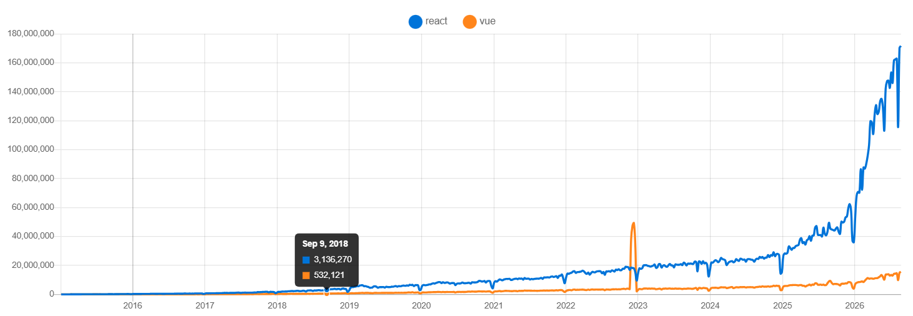
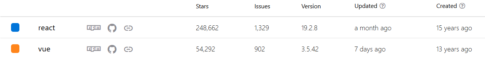
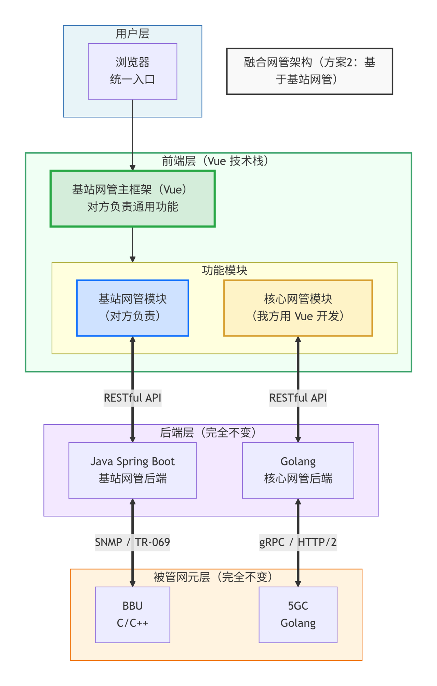
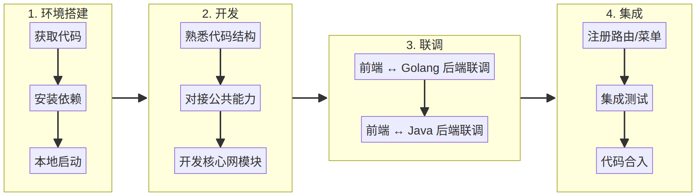

基站网管与核心网管（5GC）融合项目

融合方案执行计划（方案2）

Fusion Plan of OMC and 5GC Network Management — Plan 2

| 项目       | 基站网管与核心网管（5GC）融合 |
|---|---|
| 文档版本   | V1.0                          |
| 文档状态   | 正式发布                      |
| 编写日期   | 2026                          |
| 编写人     | 核心网管团队（我方）          |
| 对接方     | 基站网管团队（对方）          |
| 对接联系人 | 张月兵总 / 杨鹏               |
| 文档密级   | 内部                          |

★ 本文基于方案2（基于基站网管 OMC 的 Vue 仓库进行融合）整理，作为项目正式启动前的统一沟通与执行依据。

# 目  录

# 1. 项目背景与目标

## 1.1 背景

当前存在两套独立运行的网管系统：

- 基站网管（OMC）：前端 Vue，后端 Java Spring Boot，管理 BBU 等基站设备。

- 核心网管（5GC）：前端React，后端 Golang，管理 AMF / SMF / UPF / UDM / NRF 等 5GC 网元。

两套系统各自独立、互不连通，无法支撑统一运维与统一门户诉求，需要进行融合。

## 1.2 融合动因

页面涉及到前端呈现逻辑与后端接口逻辑，「谁的页面谁来做」可以避免大量跨团队沟通成本；统一导航栏中基站与核心网作为平级一级菜单分别呈现，各管各的。

基于这一原则，会议讨论形成两个候选方案（详见 §2），并最终选择方案2。

## 1.3 项目目标

- 构建统一网管门户：用户通过单一入口同时管理基站与核心网设备。

- 后端完全解耦：基站侧 Java 后端、核心网侧 Golang 后端保持不变，各自治维。

- 前端整合：基于 Vue 框架实现核心网管页面，嵌入基站网管仓库统一部署。

- 能力复用：分权分域、转发、TLS、版本管理等公共能力沿用基站侧既有实现。

- 分阶段交付：9 月底前完成基础功能（网元列表、详情、告警），后续阶段持续完善。

# 2. 方案决策

## 2.1 候选方案

围绕「前端框架」与「谁主导」两个维度，会议提出两个候选方案：

| 维度           | 方案1：基于核心网网管（React）        | 方案2：基于基站网管（Vue）          |
|---|---|---|
| 融合方式       | 在核心网代码仓库中新增基站网管模块    | 在基站代码仓库中新增核心网管模块    |
| 前端框架       | React（核心网侧既有框架）             | Vue（基站侧既有框架）               |
| 主导方         | 核心网团队（我方）                    | 基站网管团队（对方）                |
| 基站页面实现   | 对方在核心网仓库用 React 重写基站页面 | 基站页面保持不变，仍在基站仓库      |
| 核心网页面实现 | 保持不变                              | 我方在基站仓库用 Vue 重写核心网页面 |
| 后端           | 不变（Java + Golang 各自维持）        | 不变（Java + Golang 各自维持）      |
| 公共能力适配   | 核心网侧负责通用功能等                | 基站侧负责通用功能等                |

## 2.2 决策结论

经双方沟通确认采用方案2：基于基站网管（Vue）仓库进行融合。我方将核心网管功能在基站仓库中用 Vue 重新实现，负责与 5GC 后端交互。

## 2.3 决策理由

# 3. 总体方案描述

| 项目           | 内容                                                           |
|---|---|
| 融合方式       | 基于对方基站网管（OMC），在其代码仓库中新增核心网管模块        |
| 前端框架       | Vue.js（复用对方基站网管既有框架）                             |
| 核心网模块实现 | 我方使用 Vue 在基站网管仓库中重新实现核心网管功能              |
| 后端           | 完全不变：基站侧 Java，核心网侧 Golang                         |
| 页面分工       | 基站页面 → 对方负责；核心网页面 → 我方负责                   |
| 主导方         | 对方（基站网管团队）主导整体融合                               |
| 我方角色       | 在基站网管仓库中，用 Vue 开发核心网管模块，负责与 5GC 后端交互 |

# 4. 融合后架构

融合后形成「统一前端入口 + 双后端并存 + 双被管网元」的分层架构：

- 用户层：浏览器通过统一入口访问，导航栏中基站与核心网分别作为一级菜单。

- 前端层：基于 Vue 的基站网管主框架，新增核心网管模块；各模块独立维护，按需注册菜单与路由。

- 后端层：基站侧 Java Spring Boot 与核心网侧 Golang 各自独立，对应模块仅与各自后端联调。

- 被管网元层：BBU 与 5GC 网元保持原有南向协议（SNMP/TR-069、gRPC/HTTP2）。

图 4-1  融合后网管架构（方案2）

# 5. 页面与功能分工

| 页面/功能模块     | 负责方    | 技术栈      | 说明                                                       |
|---|---|---|---|
| 基站网管功能      | 对方      | Vue         | 已有功能，保持不变                                         |
| 基础框架/公共组件 | 对方/我方 | Vue         | 菜单、导航、布局、SSO、分权分域、转发、TLS、版本管理等适配 |
| 核心网管功能      | 我方      | Vue         | 在基站仓库中用 Vue 重新实现核心网管页面                    |
| 核心网管后端交互  | 我方      | RESTful API | 我方开发的 Vue 页面调用 Golang 后端接口                    |

结论：双方各自负责自身的页面与后端交互，公共框架与公共组件由基站侧统一提供，我方只做适配与对接。

# 6. 分阶段实施计划

## 6.1 阶段总览

| 阶段     | 时间窗口  | 里程碑目标                                          | 负责方   |
|---|---|---|---|
| 第一阶段 | 至 9 月底 | 基础功能实现：网元列表 / 详情 / 基础告警 / 框架适配 | 我方主导 |
| 第二阶段 |           | 完整告警管理、性能监控、拓扑展示                    | 我方主导 |
| 第三阶段 |           | 配置下发、批量操作、自动化运维                      | 我方主导 |

## 6.2 第一阶段（P0 / P1 / P2）任务清单

| 优先级 | 功能模块     | 具体内容                                               | 负责方      |
|---|---|---|---|
| P0     | 框架适配     | 在基站网管 Vue 仓库中，新增核心网管路由 / 菜单入口     | 我方 + 对方 |
| P0     | 网元列表展示 | 展示 5GC 网元（AMF/SMF/UPF/UDM/NRF），含状态、IP、版本 | 我方        |
| P0     | 网元详情查看 | 点击网元查看详细配置信息和运行状态                     | 我方        |
| P1     | 基础告警列表 | 展示 5GC 告警信息                                      | 我方        |
| P1     | 公共组件对接 | 适配对方的分权分域、转发、TLS、版本管理等通用能力      | 我方        |
| P2     | 网元基础操作 | 网元重启、配置查询等简单操作                           | 我方        |

## 6.3 后续阶段

| 阶段     | 内容                             | 负责方 | 预计时间 |
|---|---|---|---|
| 第二阶段 | 完整告警管理、性能监控、拓扑展示 | 我方   |          |
| 第三阶段 | 配置下发、批量操作、自动化运维   | 我方   |          |

# 7. 对外材料需求清单

## 7.1 基站前端（Vue 仓库）

| 序号 | 材料              | 说明                                                | 紧急程度 |
|---|---|---|---|
| 1    | 基站 Vue 前端代码 | 完整源代码，包含路由、菜单、公共组件                | 🔴 高    |
| 2    | 前端工程化配置    | package.json、vue.config.js、构建脚本、环境变量配置 | 🔴 高    |
| 3    | 本地开发/调试方法 | 如何启动、调试、代理配置                            | 🔴 高    |
| 4    | 公共组件/工具库   | 分权分域、转发、TLS、版本管理等通用能力的使用方式   | 🔴 高    |
| 5    | 路由/菜单配置规范 | 如何在现有系统中新增菜单和路由                      | 🔴 高    |
| 6    | UI 设计规范       | 颜色、字体、组件库、布局标准                        | 🟡 中    |
| 7    | SSO/认证对接方式  | 登录态获取、用户信息、权限校验方式                  | 🔴 高    |

## 7.2 基站后端（Java）

| 序号 | 材料               | 说明                                                      | 紧急程度 |
|---|---|---|---|
| 8    | Java 后端 API 文档 | Swagger/OpenAPI 或 Postman 接口定义（部分功能可能需联调） | 🟡 中    |
| 9    | 联调环境信息       | 测试环境地址、数据库、账号权限等                          | 🔴 高    |

## 7.3 核心网后端（Golang）— 我方已有

| 序号 | 材料            | 说明                          | 状态        |
|---|---|---|---|
| 10   | Golang API 文档 | 5GC 网管 RESTful API 接口定义 | ✅ 我方已有 |
| 11   | 开发/测试环境   | Golang 后端服务地址、账号     | ✅ 我方已有 |

# 8. 我方工作分解（WBS）

| 序号 | 工作项             | 说明                                        | 负责人 |
|---|---|---|---|
| 1    | 获取对方 Vue 代码  | 找对方拿到完整的基站网管前端仓库            | 待定   |
| 2    | 搭建本地开发环境   | 在本地把对方 Vue 项目跑起来                 | 待定   |
| 3    | 熟悉代码结构       | 了解路由、菜单、公共组件、API 调用方式      | 待定   |
| 4    | 对接公共能力       | 适配分权分域、转发、TLS、版本管理等通用能力 | 待定   |
| 5    | 开发核心网模块     | 用 Vue 实现网元列表、详情、告警等核心功能   | 待定   |
| 6    | 与 Golang 后端联调 | 我方开发的 Vue 页面调用 Golang 后端接口     | 待定   |
| 7    | 集成到主框架       | 将核心网模块注册到对方主框架的菜单/路由中   | 待定   |
| 8    | 提交/合并代码      | 代码合入对方仓库，部署测试                  | 待定   |

# 9. 研发流程

整体研发划分为四个阶段：环境搭建 → 开发 → 联调 → 集成。各阶段顺序推进，前一阶段产出作为下一阶段输入。

图 9-1  研发流程（基于对方仓库）

# 职责分工

边界原则：波及谁的功能谁维护，波及谁的代码谁维护。

| 角色                 | 职责                                                                                                                                         |
|---|---|
| 对方（基站网管团队） | 提供 Vue 代码仓库、公共能力（分权分域 / 转发 / TLS / 版本管理）、UI 规范、联调环境；主导整体融合架构设计；负责维护基站侧页面和功能；集成测试 |
| 我方（核心网管团队） | 在基站 Vue 仓库中开发核心网管功能模块；适配对方公共组件；与 Golang 后端联调；确保核心网功能正常运行                                          |

# 11. 关键风险与应对

| 风险                  | 影响                                                     | 应对措施                                   |
|---|---|---|
| 对方代码仓库获取延迟  | 我方无法启动开发                                         | 提前沟通，明确需求，尽快拿到代码           |
| 公共组件/能力文档不全 | 我方无法正确适配分权分域等能力                           | 找对方接口人一对一沟通，或参考现有代码仿写 |
| Vue 版本/技术栈差异   | 我方不熟悉对方技术栈（如 Vue 2 vs Vue 3、UI 组件库差异） | 提前确认技术栈版本，我方团队提前学习       |
| 联调环境不稳定        | 无法正常联调测试                                         | 搭建本地 Mock 服务，减少对远端环境依赖     |
| UI 风格不一致         | 核心网模块与基站模块视觉割裂                             | 尽早拿到 UI 规范，严格按规范开发           |
| 代码合入冲突          | 合并代码时产生大量冲突                                   | 频繁拉取最新代码，保持与主分支同步         |

# 12. 下一步行动清单

| 序号 | 行动项                                      | 负责人 | 截止时间 |
|---|---|---|---|
| 1    | 找对方获取基站 Vue 前端代码                 | 待定   | 尽快 🔴  |
| 2    | 找对方获取公共组件/能力使用文档             | 待定   | 尽快 🔴  |
| 3    | 找对方获取 UI 设计规范                      | 待定   | 本周     |
| 4    | 确认对方 Vue 技术栈版本（Vue 2/3、UI 库等） | 待定   | 本周     |
| 5    | 在本地搭建对方 Vue 项目开发环境             | 待定   | 本周     |
| 6    | 熟悉代码结构，确定核心网模块插入点          | 待定   | 本周     |
| 7    | 确认第一阶段功能范围（P0/P1 具体需求）      | 待定   | 本周     |
| 8    | 启动核心网模块 Vue 开发                     | 待定   | 本周     |
| 9    | 与对方确认联调时间、环境、接口人            | 待定   | 本周     |

# 13. 待确认事项

- 第一阶段 P0 / P1 功能范围的最终界定（特别是告警来源、性能指标口径）。

- 基站侧 Vue 版本（Vue 2 / Vue 3）与 UI 组件库（Element Plus / Ant Design Vue 等）。

- 核心网管模块在主框架的菜单位置与权限模型（管理员 / 操作员 / 审计员）。

- 联调环境的部署架构与网络可达性，特别是 5GC 后端是否对外开放。

- 代码合入流程：分支策略、Review 机制、CI/CD、版本号与发布节奏。

- 日志、监控、告警通知的统一规范是否由基站侧统一提供。

# 附录 A  修订历史

| 版本 | 日期 | 修订人       | 修订说明                                |
|---|---|---|---|
| V1.0 | 2026 | 核心网管团队 | 初版，基于方案2决策梳理融合方案执行计划 |

— 文档结束 —
