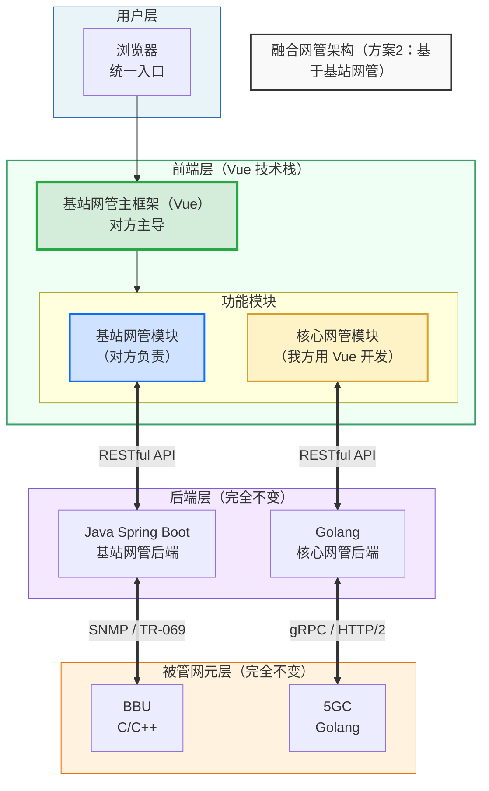
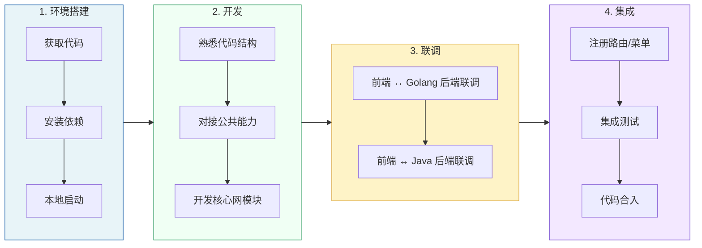

# 融合方案执行计划（方案2）

> 记录日期:2026-09-03 · 来源:DeepSeek 对话分享

## 原始需求

> 因为页面涉及到前端呈现逻辑/后端接口逻辑，谁的页面谁来做可以避免很多沟通。
> 页面多加些导航栏，基站/核心网 各呈现各自的。
>
> 1. 如果是基于核心网网管，使用 react；核心网负责适配相关分权分域、转发、tls、版本等通用功能；基站负责将目前基站的页面在核心网代码仓库用 react 实现，功能基站自己定，并与基站后端交互。
> 2. 如果是基于基站网管，使用 vue；基站负责适配相关公共部分；核心网负责将目前核心网功能使用 vue 加在基站网管，负责跟 5gc 后端交互。
>
> 现在用方案 2，我们把核心网网管在基站仓库用 react 实现。
>
> 整理了一份融合方案执行计划

---

## 执行计划

好的，基于你们最终确定的 **方案2**，帮你重新整理一份完整的融合方案执行计划。

### 一、方案概述

| 项目 | 内容 |
| :--- | :--- |
| **融合方式** | 基于对方基站网管（OMC），在其代码仓库中新增核心网管模块 |
| **前端框架** | Vue.js（对方基站网管使用 Vue，复用现有框架） |
| **核心网模块实现方式** | 我方将核心网管功能使用 **Vue** 重新实现，嵌入基站网管仓库 |
| **后端** | **完全不变**：基站侧 Java 后端，核心网侧 Golang 后端 |
| **页面分工** | 基站页面 → 对方负责；核心网页面 → 我方负责 |
| **主导方** | 对方（基站网管团队）主导整体融合 |
| **我方角色** | 在基站网管仓库中，用 Vue 开发核心网管功能模块，负责与 5GC 后端交互 |

### 二、融合后的架构

### 三、页面分工

| 页面/功能模块 | 负责方 | 技术栈 | 说明 |
| :--- | :--- | :--- | :--- |
| **基站网管功能** | 对方 | Vue | 已有功能，保持不变 |
| **基础框架/公共组件** | 对方 | Vue | 菜单、导航、布局、SSO、分权分域、转发、TLS、版本管理等 |
| **核心网管功能** | **我方** | **Vue** | 在基站仓库中用 Vue 重新实现核心网管页面 |
| **核心网管后端交互** | **我方** | RESTful API | 我方开发的 Vue 页面调用 Golang 后端接口 |

### 四、分阶段计划

#### 第一阶段（9月底）：基础功能实现

| 优先级 | 功能模块 | 具体内容 | 负责方 |
| :--- | :--- | :--- | :--- |
| P0 | **框架适配** | 在基站网管 Vue 仓库中，新增核心网管路由/菜单入口 | 我方 + 对方 |
| P0 | **网元列表展示** | 展示 5GC 网元列表（AMF/SMF/UPF/UDM/NRF），含状态、IP、版本 | 我方 |
| P0 | **网元详情查看** | 点击网元查看详细配置信息和运行状态 | 我方 |
| P1 | **基础告警列表** | 展示 5GC 告警信息 | 我方 |
| P1 | **公共组件对接** | 适配对方的分权分域、转发、TLS、版本管理等通用能力 | 我方 |
| P2 | **网元基础操作** | 网元重启、配置查询等简单操作 | 我方 |

#### 后续阶段（待协商）

| 阶段 | 内容 | 负责方 | 预计时间 |
| :--- | :--- | :--- | :--- |
| **第二阶段** | 完整告警管理、性能监控、拓扑展示 | 我方 | 10月-11月 |
| **第三阶段** | 配置下发、批量操作、自动化运维 | 我方 | 12月+ |
| **基站侧演进** | 基站功能增强、优化 | 对方 | 持续 |

### 五、需要向对方索取的材料清单

#### 5.1 基站前端（Vue 仓库）

| 序号 | 材料 | 说明 | 紧急程度 |
| :--- | :--- | :--- | :--- |
| 1 | **基站 Vue 前端代码** | 完整源代码，包含路由、菜单、公共组件 | 🔴 高 |
| 2 | **前端工程化配置** | package.json、vue.config.js、构建脚本、环境变量配置 | 🔴 高 |
| 3 | **本地开发/调试方法** | 如何启动、调试、代理配置 | 🔴 高 |
| 4 | **公共组件/工具库** | 分权分域、转发、TLS、版本管理等通用能力的使用方式 | 🔴 高 |
| 5 | **路由/菜单配置规范** | 如何在现有系统中新增菜单和路由 | 🔴 高 |
| 6 | **UI 设计规范** | 颜色、字体、组件库、布局标准 | 🟡 中 |
| 7 | **SSO/认证对接方式** | 登录态获取、用户信息、权限校验方式 | 🔴 高 |

#### 5.2 基站后端（Java）

| 序号 | 材料 | 说明 | 紧急程度 |
| :--- | :--- | :--- | :--- |
| 8 | **Java 后端 API 文档** | Swagger/OpenAPI 或 Postman 接口定义（部分功能可能需联调） | 🟡 中 |
| 9 | **联调环境信息** | 测试环境地址、数据库、账号权限等 | 🔴 高 |

#### 5.3 核心网后端（Golang）— 我方已有

| 序号 | 材料 | 说明 | 状态 |
| :--- | :--- | :--- | :--- |
| 10 | **Golang API 文档** | 5GC 网管 RESTful API 接口定义 | ✅ 我方已有 |
| 11 | **开发/测试环境** | Golang 后端服务地址、账号 | ✅ 我方已有 |

### 六、我方需要做的工作

| 序号 | 工作项 | 说明 | 负责人 |
| :--- | :--- | :--- | :--- |
| 1 | **获取对方 Vue 代码** | 找对方拿到完整的基站网管前端仓库 | 待定 |
| 2 | **搭建本地开发环境** | 在本地把对方 Vue 项目跑起来 | 待定 |
| 3 | **熟悉代码结构** | 了解路由、菜单、公共组件、API 调用方式 | 待定 |
| 4 | **对接公共能力** | 适配分权分域、转发、TLS、版本管理等通用能力 | 待定 |
| 5 | **开发核心网模块（Vue）** | 用 Vue 实现网元列表、详情、告警等核心功能 | 待定 |
| 6 | **与 Golang 后端联调** | 我方开发的 Vue 页面调用 Golang 后端接口 | 待定 |
| 7 | **集成到主框架** | 将核心网模块注册到对方主框架的菜单/路由中 | 待定 |
| 8 | **提交/合并代码** | 代码合入对方仓库，部署测试 | 待定 |

### 七、研发流程（基于对方仓库）

### 八、职责分工总结

| 角色 | 职责 |
| :--- | :--- |
| **对方（基站网管团队）** | 提供 Vue 代码仓库、公共能力（分权分域/转发/TLS/版本管理）、UI 规范、联调环境；主导整体融合架构设计；负责基站侧页面和功能 |
| **我方（核心网管团队）** | 在基站 Vue 仓库中开发核心网管功能模块；适配对方公共组件；与 Golang 后端联调；确保核心网功能正常运行 |

### 九、关键风险与应对

| 风险 | 影响 | 应对措施 |
| :--- | :--- | :--- |
| **对方代码仓库获取延迟** | 我方无法启动开发 | 提前沟通，明确需求，尽快拿到代码 |
| **公共组件/能力文档不全** | 我方无法正确适配分权分域等能力 | 找对方接口人一对一沟通，或参考现有代码仿写 |
| **Vue 版本/技术栈差异** | 我方不熟悉对方技术栈（如 Vue 2 vs Vue 3、UI 组件库差异） | 提前确认技术栈版本，我方团队提前学习 |
| **联调环境不稳定** | 无法正常联调测试 | 搭建本地 Mock 服务，减少对远端环境依赖 |
| **UI 风格不一致** | 核心网模块与基站模块视觉割裂 | 尽早拿到 UI 规范，严格按规范开发 |
| **代码合入冲突** | 合并代码时产生大量冲突 | 频繁拉取最新代码，保持与主分支同步 |

### 十、下一步行动清单

| 序号 | 行动项 | 负责人 | 截止时间 |
| :--- | :--- | :--- | :--- |
| 1 | 找对方获取基站 Vue 前端代码 | 待定 | 尽快 🔴 |
| 2 | 找对方获取公共组件/能力使用文档 | 待定 | 尽快 🔴 |
| 3 | 找对方获取 UI 设计规范 | 待定 | 本周 |
| 4 | 确认对方 Vue 技术栈版本（Vue 2/3、UI 库等） | 待定 | 本周 |
| 5 | 在本地搭建对方 Vue 项目开发环境 | 待定 | 本周 |
| 6 | 熟悉代码结构，确定核心网模块插入点 | 待定 | 本周 |
| 7 | 确认第一阶段功能范围（P0/P1 具体需求） | 待定 | 本周 |
| 8 | 启动核心网模块 Vue 开发 | 待定 | 本周 |
| 9 | 与对方确认联调时间、环境、接口人 | 待定 | 本周 |

### 十一、沟通口径（发给对方）

> 张月兵/杨鹏：
>
> 根据上午沟通，确认采用 **方案2**：基于基站网管（Vue）进行融合，我方将核心网管功能在基站仓库中用 Vue 重新实现。
>
> 为启动开发，需贵方协助提供以下材料：
>
> **前端相关：**
> 1. 基站 Vue 前端完整代码仓库
> 2. 前端工程化配置（package.json、构建脚本、环境变量等）
> 3. 本地开发/调试方法文档
> 4. 公共组件/工具库使用说明（分权分域、转发、TLS、版本管理等）
> 5. 菜单/路由新增规范
> 6. UI 设计规范（颜色、字体、组件库等）
> 7. SSO/认证对接方式
>
> **后端相关：**
> 8. Java 后端 API 文档（Swagger/OpenAPI）
> 9. 联调测试环境信息
>
> 我方收到材料后，会尽快启动开发，第一阶段（9月底）聚焦核心网网元列表、详情展示和基础告警功能。后续联调时间我们再约。
>
> 感谢！🙏
